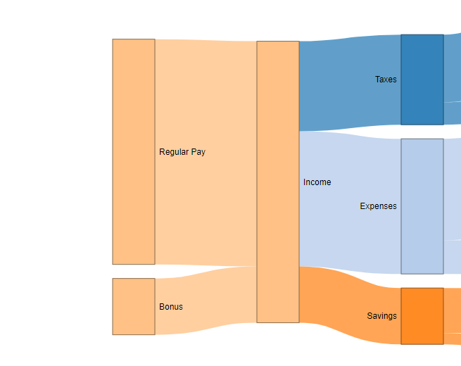

Budget Sankey Diagram
================

# Includes

``` r
library(networkD3)
library(jsonlite)
library(rjson)
```

    ## 
    ## Attaching package: 'rjson'

    ## The following objects are masked from 'package:jsonlite':
    ## 
    ##     fromJSON, toJSON

``` r
library(tidyverse)
```

    ## ── Attaching core tidyverse packages ──────────────────────── tidyverse 2.0.0 ──
    ## ✔ dplyr     1.1.4     ✔ readr     2.1.4
    ## ✔ forcats   1.0.0     ✔ stringr   1.5.1
    ## ✔ ggplot2   3.4.4     ✔ tibble    3.2.1
    ## ✔ lubridate 1.9.3     ✔ tidyr     1.3.0
    ## ✔ purrr     1.0.2

    ## ── Conflicts ────────────────────────────────────────── tidyverse_conflicts() ──
    ## ✖ dplyr::filter()   masks stats::filter()
    ## ✖ purrr::flatten()  masks jsonlite::flatten()
    ## ✖ rjson::fromJSON() masks jsonlite::fromJSON()
    ## ✖ dplyr::lag()      masks stats::lag()
    ## ✖ rjson::toJSON()   masks jsonlite::toJSON()
    ## ℹ Use the conflicted package (<http://conflicted.r-lib.org/>) to force all conflicts to become errors

``` r
library(readxl)
options(dplyr.summarise.inform = FALSE)
```

# Load data

``` r
data <- read_excel('sample_data.xlsx')
total_value <- sum((data %>% filter(target == 'Income'))$value)
data
```

    ## # A tibble: 11 × 4
    ##    source      target     value link_group
    ##    <chr>       <chr>      <dbl> <chr>     
    ##  1 Income      Taxes         40 taxes     
    ##  2 Income      Expenses      60 expenses  
    ##  3 Income      Savings       25 savings   
    ##  4 Regular Pay Income       100 income    
    ##  5 Bonus       Income        25 income    
    ##  6 Taxes       Federal       30 taxes     
    ##  7 Taxes       State         10 taxes     
    ##  8 Expenses    Rent          45 expenses  
    ##  9 Expenses    Groceries     15 expenses  
    ## 10 Savings     Retirement    20 savings   
    ## 11 Savings     Cash           5 savings

# Collect list of unique nodes

``` r
nodes <- tibble(name = data$source) %>%
  bind_rows(tibble(name = data$target)) %>%
  unique() %>%
  mutate(id = 1:n() - 1) %>%
  left_join(data %>% group_by(target, link_group) %>% summarise() %>% rename(name = target, node_group = link_group), by = join_by(name)) %>%
  mutate(node_group = ifelse(is.na(node_group), 'income', node_group))
nodes
```

    ## # A tibble: 12 × 3
    ##    name           id node_group
    ##    <chr>       <dbl> <chr>     
    ##  1 Income          0 income    
    ##  2 Regular Pay     1 income    
    ##  3 Bonus           2 income    
    ##  4 Taxes           3 taxes     
    ##  5 Expenses        4 expenses  
    ##  6 Savings         5 savings   
    ##  7 Federal         6 taxes     
    ##  8 State           7 taxes     
    ##  9 Rent            8 expenses  
    ## 10 Groceries       9 expenses  
    ## 11 Retirement     10 savings   
    ## 12 Cash           11 savings

# Define links between nodes

``` r
links <- data %>%
  inner_join(nodes %>% rename(source=name) %>% select(-node_group), by = join_by(source)) %>%
  select(-source) %>%
  rename(source = id) %>%
  inner_join(nodes %>% rename(target=name) %>% select(-node_group), by = join_by(target)) %>%
  select(-target) %>%
  rename(target = id)
links
```

    ## # A tibble: 11 × 4
    ##    value link_group source target
    ##    <dbl> <chr>       <dbl>  <dbl>
    ##  1    40 taxes           0      3
    ##  2    60 expenses        0      4
    ##  3    25 savings         0      5
    ##  4   100 income          1      0
    ##  5    25 income          2      0
    ##  6    30 taxes           3      6
    ##  7    10 taxes           3      7
    ##  8    45 expenses        4      8
    ##  9    15 expenses        4      9
    ## 10    20 savings         5     10
    ## 11     5 savings         5     11

# Create base chart

``` r
# add a column that specifies alignment - this will be used by javascript later
nodes <- nodes %>%
  mutate(label_align = ifelse(node_group == 'income', 'left', 'right')) %>%
  mutate(label_align = ifelse(node_group == tolower(name), 'center', label_align))

# calculate percentages for label suffixes
suffixes <- data %>%
  group_by(source) %>%
  summarise(value = sum(value)) %>%
  rename(name = source) %>%
  bind_rows(data %>%
              group_by(target) %>%
              summarise(value = sum(value)) %>%
              rename(name = target)) %>%
  group_by(name) %>% summarise(value = max(value)) %>%
  mutate(suffix = paste0('(', round(100 * value / total_value, 1), '%)')) %>%
  select(-value)

# create chart object
sankey <- sankeyNetwork(Links = as.data.frame(links), Nodes = as.data.frame(nodes), Source = 'source',
              Target = 'target', Value = 'value', NodeID = 'name',
              LinkGroup = 'link_group',
              NodeGroup = 'node_group',
              fontFamily = 'Arial',
              fontSize = 12, nodeWidth = 60, nodePadding = 20,
              sinksRight = TRUE,
              margin = list(top=0, right=150, left=175, bottom=0),
              height = 500, width=1000)
sankey
```

<!-- -->

# Render with custom formatting

``` r
# add additional columns to chart data
sankey$x$nodes$label_align <- nodes$label_align
sankey$x$nodes <- sankey$x$nodes %>% mutate(align_left = ifelse(label_align == 'left', TRUE, FALSE))
sankey$x$nodes <- sankey$x$nodes %>% mutate(align_center = ifelse(label_align == 'center', TRUE, FALSE))
sankey$x$nodes <- sankey$x$nodes %>% mutate(align_right = ifelse(label_align == 'right', TRUE, FALSE))
sankey$x$nodes <- sankey$x$nodes %>% left_join(suffixes, by = join_by(name))

# render chart with custom javascript
htmlwidgets::onRender(
  sankey,
  '
  function(el,x) {

  
  d3.select(el)
    .selectAll(".node text")
    .filter(function(d) { return d.align_left; })
    .attr("x", -10)
    .attr("text-anchor", "end");
    
  d3.select(el)
    .selectAll(".node text")
    .filter(function(d) { return d.align_right; })
    .attr("x", x.options.nodeWidth+ 5)
    .attr("text-anchor", "start");
  
  d3.select(el)
    .selectAll(".node text")
    .filter(function(d) { return d.align_center; })
    .attr("x", x.options.nodeWidth / 2)
    .attr("text-anchor", "middle");

  d3.select(el).selectAll(".node text").filter(function(d) { return d.align_center; }).each(function(d){
    var arr, val, anc
    arr = " " + d.suffix;
    arr = arr.split(" ");
    val = d3.select(this).attr("x");
    anc = d3.select(this).attr("text-anchor"); 
    for(i = 0; i < arr.length; i++) {
      d3.select(this).append("tspan")
          .text(arr[i])
          .attr("dy", i ? "1.2em" : 0)
          .attr("x", val)
          .attr("text-anchor", anc)
          .attr("class", "tspan" + i)
      }
    });

  d3.select(el).selectAll(".node text")
    .filter(function(d) { return !d.align_center; })
    .text(d => d.name + " " + d.suffix)
  }
  '
)
```

<!-- -->
